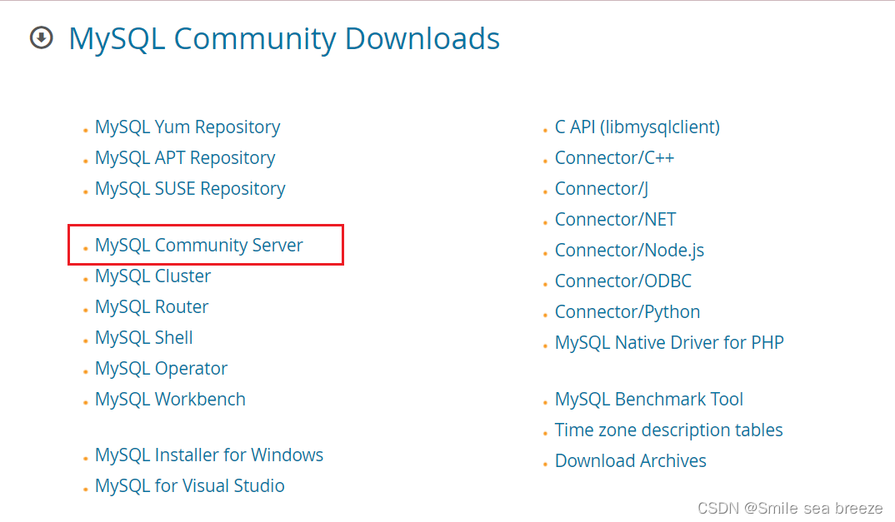
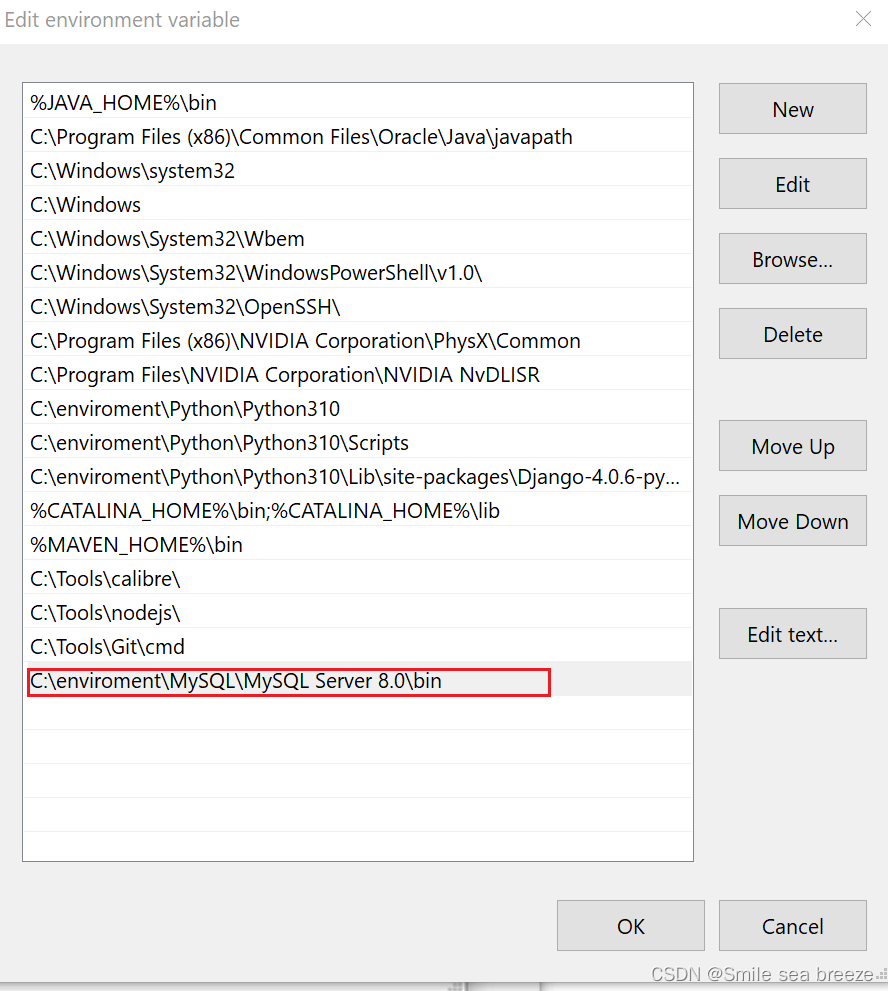

# Mysql安装方法

# 1.官网下载

https://dev.mysql.com/downloads/windows/installer/8.0.html

**选择MSI安装比较方便，压缩版配置比较麻烦，新手选择MSI方式安装**

**两者区别在于内存小的是在线版，内存大的是离线版，建议选择内存大的安装**

**程序下载确认**

# 2.下载后安装

**为了方便了解程序安装，我们选择Custom的安装**

**存储路径的选择**

**安装确认**

**程序配置**

**需要设置mysql的密码，默认的装户名为root**

**安装完成**

**确认安装的程序**

# 3.设置环境配置

**添加安装mysql的安装的路径**

# 4.打开cmd确认是否安装

--mysql已经安装成功！！！
