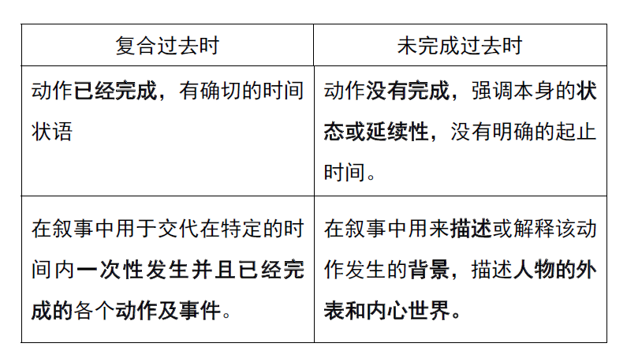

# 法语的时态

# 动词变位

法语的动词在实际语言应用中因人称（la personne）、时态、语式、语态等因
素，有不同的词形变化，即动词变位。

根据词尾的形式，动词可分为三大组：

**第一组规则动词以-er 结尾**

**第二组规则动词以-ir 结尾**

**第三组动词为不规则动词。**

因此法语动词的变位也是根据这三个分组有其各自的规则。直陈式现在时是法语动词变位的基础

# 直陈式现在时

### 用法：

#### 1.表示说话时正在进行或正在完成中的动作：

- Où est Claire, tu sais ? 你知道克莱尔在哪里吗？
- Qu’est-ce qu’il y a ? Elle regarde des émissions de télévision à lamaison.有什么事？他正在家看着电视节目呢。

#### 2.表示经常重复的动作或过去已经发生而现在仍继续进行的动作：

Ce n’est pas étonnant qu’il ne soit pas arrivé, il est toujours en retard.他还没到，这并不奇怪，他老是迟到。
Il fait de la gymnastique tous les jours. 他天天做体操。
On vous cherche depuis dix minuites. 人家已找了你10 分钟了。

这种现在时的时间标志是 tous les jours, chaque samedi, le dimanche,toujours, souvent 及介词depuis 等等。

#### 3. 表示一个永恒的现象或普遍真理。

La terre tourne autour du soleil. 地球围绕太阳转。
L’union fait la force. 团结就是力量。

#### 4.在口语中代替将来时，描述将要发生的事情，表示预定的、肯定要做的

Tu pars demain ? 你明天走？
Tu ranges ta chambre！整理一下你的房间！

### 构成：

**第一组动词：以-er 结尾的不定式词干+ -e, -es, -e, -ons, -ez, -ent.(aller**
**是第三组动词)**
**第二组动词：以-ir 结尾的不定式词干+is, -is,-it, -issons,-issez, -issent.**

**第三组动词： 不规则动词，但是avoir, être 必须熟背，因为复合过去式的构**
**成都与它们有关。**

# 过去时

## 1.复合过去时

### 用法：

#### **表示在某个确定的时间内发生并且已经结束的动作，或者在说话前已经结束的动作，与客观存在或现在有某种联系。**

Il **a** beaucoup plu cet hiver. 今年冬天下了许多雨。

Cet après-midi, nous **avons** assisté à un match du foot-ball.今天下午，我们看了一场足球赛。

Pierre et Anne **ont** habité à Paris pendant deux ans. 皮埃尔和安娜曾在巴黎住了两年。

### 构成：

#### 用avoir 或être 的现在时作助动词+过去分词

**过去分词**

**■ 第一组规则动词：去掉词尾er，加é；**
dîner → dîné manger → mangé
请注意：aller →allé
**■第二组规则动词：去掉词尾ir, 加i：**
finir → fini choisir → choisi
**■其他动词变化不规则，需要单独记忆**

#### 助动词 avoir 和être

##### **■ 用avoir 做助动词的动词：**

avoir 和être：
Tu a été ravi de revoir ta mère ? 你又看见了母亲很高兴吧？
Il a eu de la fièvre hier.他昨天发过烧。

**全部及物动词：**
Oui, j’avais longtemps attendu ce moment. 是的，我早就等着这个时刻了。
Ce mot m’a échappé. 我脱口而出说出这个字。
**大部分不及物动词：**
La terre a encore tremblé cette nuit en Italie.今晚意大利还在地震。

**请注意：**上述动词中有少数可以用作直接及物动词，词义改变，复合时态中
应用avoir 作助动词。这些动词有：
descendre 放下   entrer 搬入  monter 搬上  rentrer 放进，收藏  retourner 翻转  sortir 搬出 passer 经过 

##### **■ 用être 做助动词的动词：**

**全部代词式动词：**
Elle s’est suicidée. 她自杀了。
Le chasseur s’est caché derrière un buisson. 猎人躲在灌木丛后面。
**一部分表示移动或状态变化的不及物动词：**
aller 去  rentrer 回家  sortir 出去  devenir 变成  rester 仍是  venir 来  partir 动身  monter 上去  naître 出生
échoir 偶然来到  revenir 回来  arriver 到达  descendre 下去  mourir 死亡  parvenir 到达  passer 经过  retourner 回去
entrer 进来  tomber 落下  décéder 逝世  survenir 突然发生

## 2.未完成过去时

### 用法：

#### ■ 表示在过去某个起止点不明确的时间段内延续的动作或者持续的状态，这种动

#### 作或状态不知何时开始，也不知何时结束.

J’étais ouvrier. 我过去是工人。（动作开始与结束的时间均不明确，如果明确
了动作的期限，就不用未完成过去时）
试比较：
j’ai été ouvrier pendant deux ans avant de devenir concierge.
在当门卫之前，我做过两年的工人。

#### ■ 由于未完成过去时具有“延续性”，因此常用来解释故事的环境、背景，描述动

作发生的氛围，刻画人物的思想及精神状态。
La route était très glissante.（当时）路很滑。
Elle portait une robe bleue. 她穿着一条蓝裙子。
Il faisait froid, elle a mis un manteau. 天很冷，她穿了一件大衣。
Le camion a voulu s’arrêter mais il roulait trop vite.
卡车试图停下来，但它速度太快了。
A ce moment-là, j’étais terrifiée ! 那一刻，我吓坏了。
Hier soir, elle était bien triste. 昨晚，他非常伤心。

#### ■ 未完成过去时还常用来描写过去经常性或反复发生的动作以及习惯性的活动，

Ce jour-là, comme d’habitude, je traversais le pont.
那天，和平常一样，我从桥上穿过。
Avant, je prenais un café tous les matins. 以前，我每天早晨都喝一杯咖啡。
Quand j’étais petit, je me levais toujours très tôt. 小时候总是起得很早。

#### ■ 表示和另一过去动作同时发生的动作。这种过去时叫做“同时性的过去时”。

两种情况：
**如果两个动作都未完成，正在延续进行，就都用未完成过去时**：
Pendant que je faisais la vaisselle, mon mari préparait le café.
在我洗餐具的时候，我的丈夫在煮咖啡。
**如果一个动作尚未完成，正在进行，要用未完成过去时；另一个动作是一下**
**子就完成了，则要用复合过去时或简单过去时**：
Madame la concierge nous parlait de son travail quand son mari est entré.
门房太太正在给我们讲着她的工作，她的丈夫进来了。
L’accident a eu lieu vers minuit, pendant que tout le monde dormait.事故半夜发生，大家正在睡觉。

****

### 构成

直陈式现在时复数第一人称的变位形式去掉词尾-ons 之后， 按照
je,tu,il/elle,nous,vous,ils/elles 的人称次序分别加上**-ais,-ais,-ait,-ions,-iez,-aient**

## 3.最近过去时

### 用法：

#### 表示刚刚发生并已经完成的动作

Je viens de rentrer en Chine. 我刚刚回到中国。
Il vient de finir son travail. 他刚刚完成工作。

### 构成

#### venir de + 动词不定式

## 4.复合过去时与未完成过去时比较

**■ L’imparfait 表示过去处于某一延续状态的动作，其开始和结束时间均不明确，**
**若句子带有时间限定词，就用passé composé. 例如：**
Il travaillait dans cet hôpital.
他曾经在这家医院工作
Il a travaillé dans cet hôpital pendant 2 ans.
他曾在这家医院工作过2 两年。
**■ 未完成过去时表示过去重复发生的动作；复合过去时表示一次性动作。**
Quand j’étais petit, je passais souvent les vacances d’été chez mes
grands-parents.
L’été dernier, je suis allé chez mes grands-parents.
**■ 未完成过去时和复合过去时配合使用。即：当一个动作表示过去延续进行的动作（未完**
**成过去时），另一个动作突然发生并已完成。（复合过去时）**
Il avait six ans lorsque son père est parti pour le Maroc.
On regardait la télé quand on a frappé à la porte.

# 将来时

## 1.简单将来时

### 用法：

#### 简单将来时表示未来的可能性或将来发生的动作、出现的状态。

Il fera beau demain. 明天晴天。
Elle viendra me voir ce week-end. 她这个周末来看我。
J’enverrai cette lettre dans deux jours. 我两天后寄这封信。

### 构成

#### ●根据人称顺序，在动词不定式后边分别添加词尾-ai, -as, -a, -ons, -ez,-ont。

#### ■ 以-re 结尾的第三组动词变简单将来时形式，要先去掉原形动词词尾的字母e，然后再加上述词尾。

mettre → je mettrai, croire → ils croiront

#### ■ 大多数第三组动词在简单将来时的变位中，词根有变化，但词尾仍使用-ai,
-as, -a, -ons, -ez, -ont。

## 2.最近将来时

### 用法：

#### 最近将来时在现代法语中，特别是口语中被广泛使用，表示即将发生

的动作或有关将来的某种意向，包含“要”的意思。
Il va avoir 22 ans. 他马上就22 岁了。
Je vais acheter une nouvelle voiture. 我要买一辆新车。****

### 构成

#### aller 的直陈式现在时+动词不定式
